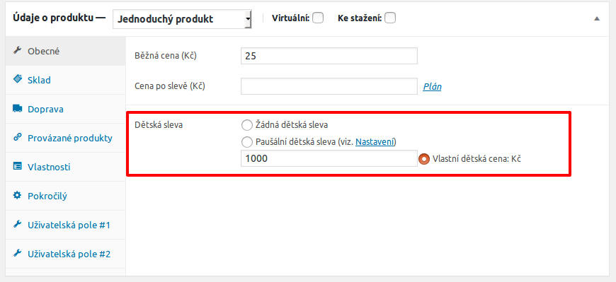
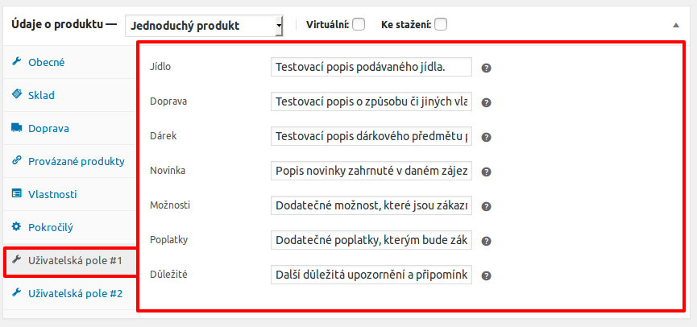
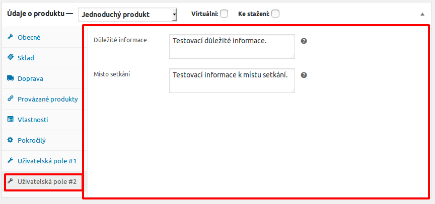

# Small WooCommerce Plugins
Small WordPress+WooCommerce plugins of mine:

## Plugins list
+ `odwp-wc-krx_child_price.php` - adds new child price ([screenshots](#child-price-plugin)),
+ `odwp-wc-krx_custom_fields_1.php` - add new set of custom fields of [WooCommerce][2] products ([screenshot](#custom-user-fields-1)),
+ `odwp-wc-krx_custom_fields_2.php` - add new set of custom fields of [WooCommerce][2] products ([screenshot](#custom-user-fields-2)).

## Screenshots

### Child Price Plugin
Adds options for child discount price.

### Custom user fields 1
Adds section with set of custom fields.

### Custom user fields 2
Adds section with set of custom fields.

[1]:https://wordpress.org/
[2]:https://woocommerce.net/
