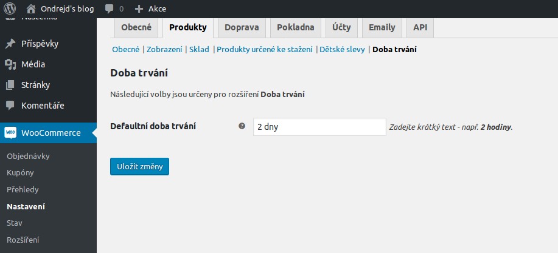

# Small WooCommerce Plugins
This repository contains some small [WordPress][1]+[WooCommerce][2] plugins of mine. You

## Included plugins
Here is a table with all included plugins:

| Plugin | Version | WP_min_ | WP_max_ | WC_min_ | WC_min_ |
|--------|---------|--------:|--------:|--------:|--------:|
| __Child Price__ - adds new child price for _WC_ products  ([screenshots](#child-price-plugin)) | 1.0.0 | 4.7 | 4.8.2 | 3.1.2 | 3.1.2 |
| __Custom User Fields 1__ - adds new set of custom fields for _WC_ products ([screenshot](#custom-user-fields-1)) | 1.0.0 | 4.7 | 4.8.2 | 3.1.2 | 3.1.2 |
| __Custom User Fields 2__ - adds new set of custom fields for _WC_ products ([screenshot](#custom-user-fields-2)) | 1.0.0 | 4.7 | 4.8.2 | 3.1.2 | 3.1.2 |
| __Trip Duration__ - adds possibility to define trip duration using new custom fields for _WC_ products ([screenshots](#trip-duration)) | 1.0.0 | 4.7 | 4.8.2 | 3.1.2 | 3.1.2 |
| __Product Properties Filter Widget__ - ... | 0.1.0 | 4.7 | 4.9 | 3.1.2 | 3.1.2 |

__Note:__ __WP_min___ is [WordPress][1] minimal version on which was plugin tested on, __WP_max___ accordingly maximal tested version; __WC_min___, __WC_max___ stands for maximal/minimal tested version of [WooCommerce][2] plugin.

## For users/developers
Here are some notes for users/developers:
+ all plugins can be downloaded on [Releases page][3] (in separate _ZIP_ files),
+ all plugins consist just from one _PHP_ source file located in [plugins][4] folder of this repository,
+ all plugins are translatable but __not translated__ and are mostly in Czech language,
+ you can build yourself distribution _ZIP_ package using `bin/build.php` script (configured to be executable as Linux shell script),
+ __if you need anything don't hesitate to contact the author of the plugins__.

## Screenshots
These screenshots fully describing functionality of each plugin.

### Child Price Plugin
Adds custom fields into product's edit page:

Adds custom settings:

### Custom user fields 1
Adds section with set of custom fields:

### Custom user fields 2
Adds section with set of custom fields:

### Trip duration
Adds custom fields into product's edit page:

Adds custom settings:

### Product Properties Filter Widget
...

[1]:https://wordpress.org/
[2]:https://woocommerce.net/
[3]:https://github.com/ondrejd/small-woocommerce-plugins/releases
[4]:https://github.com/ondrejd/small-woocommerce-plugins/tree/master/plugins
