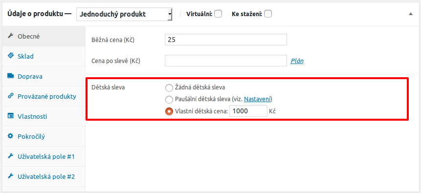

# Small WooCommerce Plugins
This repository contains some small [WordPress][1]+[WooCommerce][2] plugins of mine. Each plugin consits from just one _PHP_ source file.

## Plugins list
Plugins self are located in [plugins][4] folder but can be also downloaded on [Releases page][3].
+ `odwp-wc-krx_child_price.php` - adds new child price for _WC_ products  ([screenshots](#child-price-plugin)),
+ `odwp-wc-krx_custom_fields_1.php` - adds new set of custom fields for _WC_ products ([screenshot](#custom-user-fields-1)),
+ `odwp-wc-krx_custom_fields_2.php` - adds new set of custom fields for _WC_ products ([screenshot](#custom-user-fields-2)).
+ `odwp-wc-krx_trip_duration.php` - adds possibility to define trip duration using new custom fields for _WC_ products ([screenshots](#trip-duration)).

## Screenshots
These screenshots fully describing functionality of each plugin.

### Child Price Plugin
Adds custom fields into product's edit page:

Adds custom settings:

### Custom user fields 1
Adds section with set of custom fields:

### Custom user fields 2
Adds section with set of custom fields:

### Trip duration
Adds custom fields into product's edit page:

Adds custom settings:

[1]:https://wordpress.org/
[2]:https://woocommerce.net/
[3]:https://github.com/ondrejd/small-woocommerce-plugins/releases
[4]:https://github.com/ondrejd/small-woocommerce-plugins/tree/master/plugins
